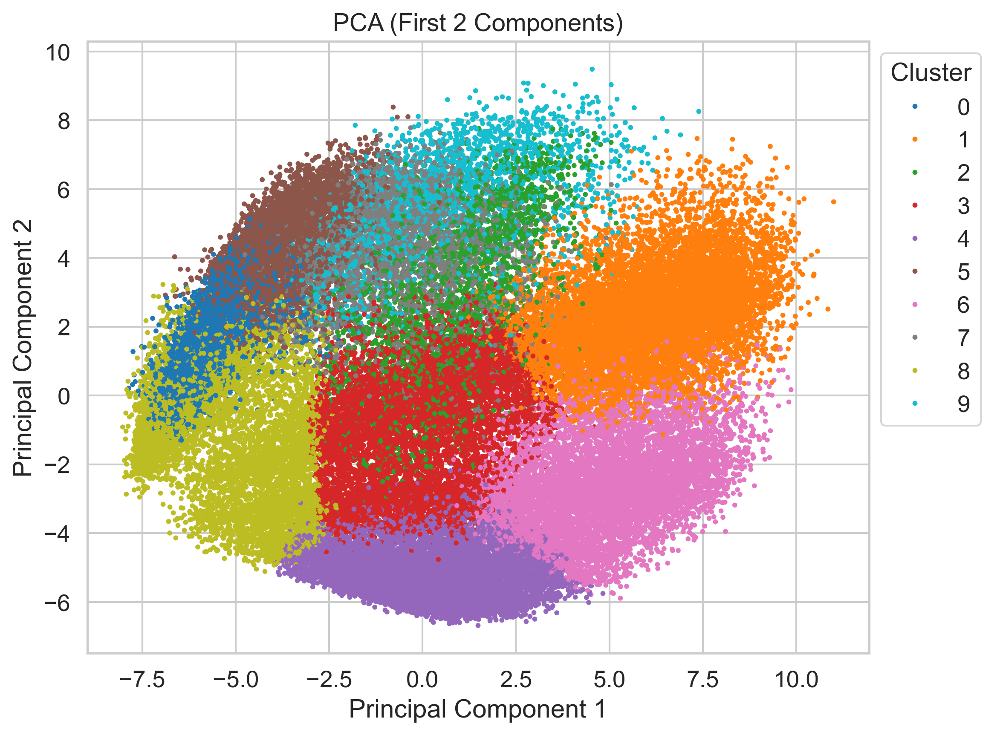
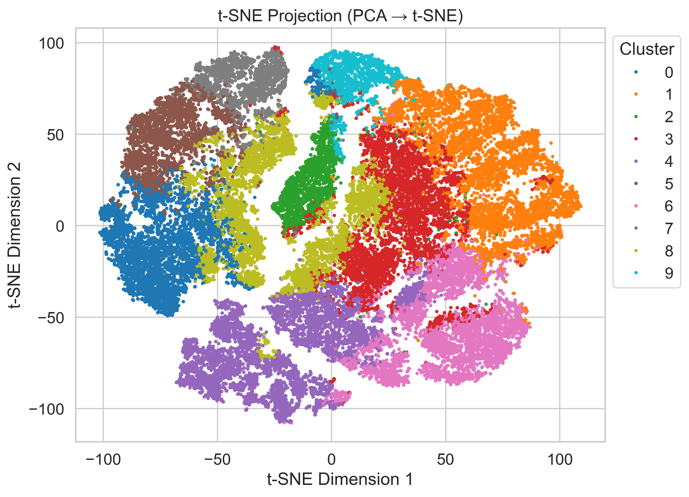
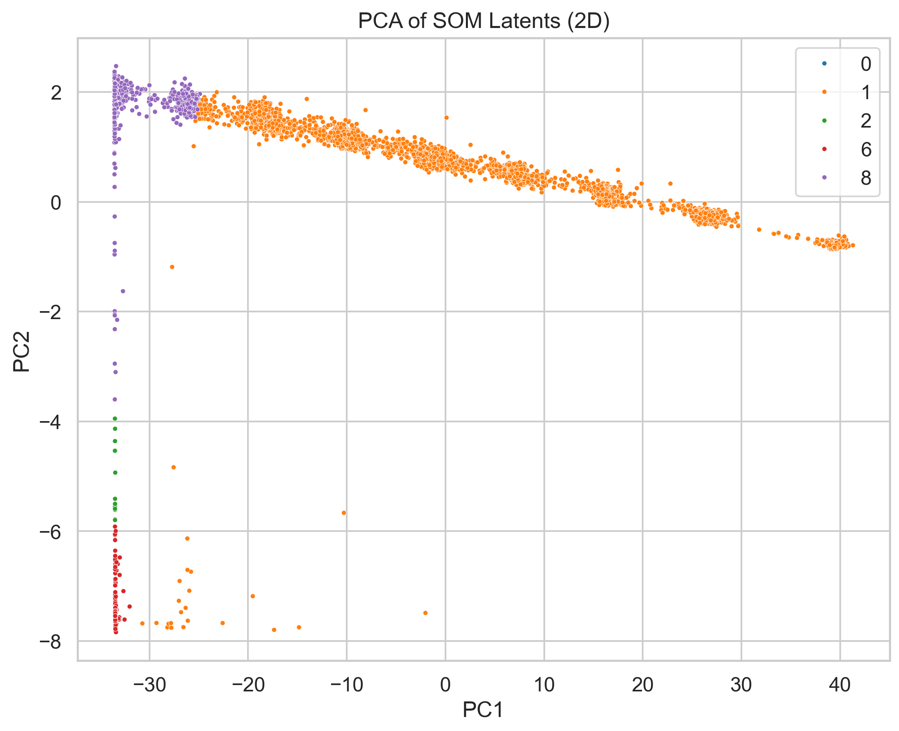
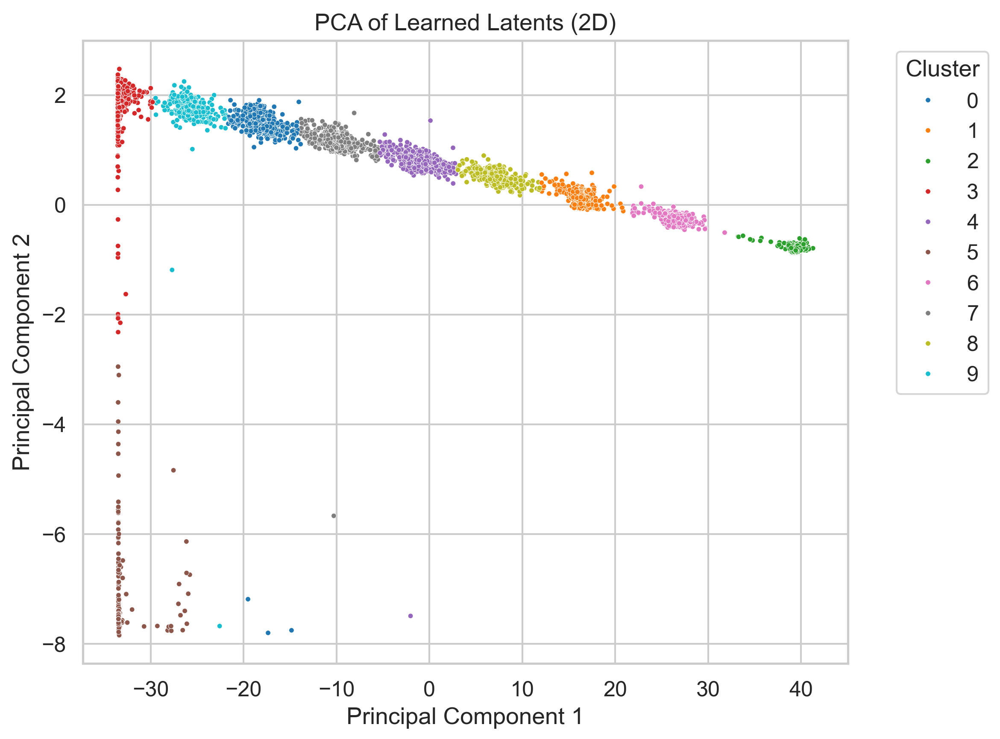
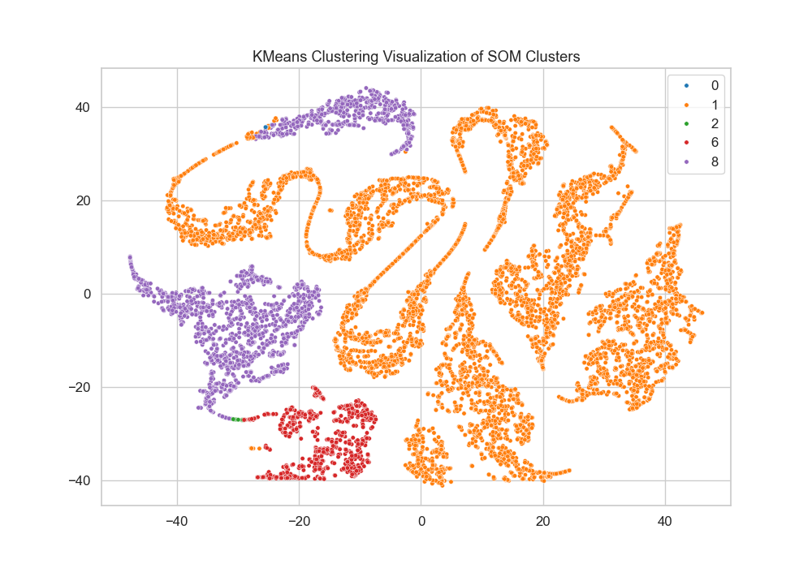

# RSWNet: A Deep Self-Organizing Map Network for Unsupervised Feature Learning and Clustering
<!-- []() -->
[](https://opensource.org/licenses/MIT)
[](https://www.python.org/downloads/release/python-380/)
[](https://pytorch.org/)

## Overview
RSWNet is a novel deep learning architecture for unsupervised feature learning and clustering. Our approach leverages a modified ResNet50 encoder and a custom decoder architecture for efficient representation learning and clustering, demonstrating superior performance on the [Fashion-MNIST dataset](https://huggingface.co/datasets/zalando-datasets/fashion_mnist).

<p align="center">
  
  <br>
  <em>Proposed Method Workflow</em>
</p>

## Key Features
- 🚀 Novel deep learning architecture combining feature learning and clustering
- 📊 Efficient training strategy optimizing both reconstruction and clustering objectives
- 🔍 Comprehensive comparative analysis with traditional clustering methods
- 📈 Superior clustering performance on Fashion-MNIST dataset

## Performance Highlights
| Metric | RSWNet | SOM |
|--------|---------|-----|
| Silhouette Score | 0.8801 | 0.2936 |
| Davies-Bouldin Index | 0.1635 | 0.4945 |
| Calinski-Harabasz Index | 738030.1875 | 3609.6191 |

## Visualizations
The notebook provides 2D visualizations of the learned latent space using both PCA and t-SNE:

PCA of SOM Latents
t-SNE of SOM Latents
These plots help to visually assess the quality of clustering and the separation of classes in the latent space.
### Clustering Visualization
<table>
    <tr>
        <td align="center">
            
            <br>
            <em>Initial K Means Clustering on Raw Training Data (t-SNE)</em>
        </td>
        <td align="center">
            
            <br>
            <em>Initial K Means Clustering on Raw Training Data (PCA)</em>
        </td>
        <td align="center">
            
            <br>
            <em>Initial K Means Clustering on Raw Training Data (t-SNE)</em>
        </td>
    </tr>
</table>

### PCA and t-SNE Visualizations
<table>
  <tr>
    <td align="center">
      <br>
      <em>SOM Clustering Results (PCA)</em>
    </td>
    <td align="center">
      <br>
      <em>RSWNet Clustering Results (t-SNE)</em>
    </td>
  </tr>
  <tr>
    <td align="center">
      <br>
      <em>RSWNet Clustering Results (PCA)</em>
    </td>
    <td align="center">
      <br>
      <em>SOM Clustering Results (t-SNE)</em>
    </td>
  </tr>
</table>

## Installation
```
git clone https://github.com/RejwanShafi25/RSWNet.git
cd RSWNet
pip install -r requirements.txt
```

## Model Architecture
The following diagram shows the detailed architecture of RSWNet, including the encoder, decoder, and clustering pipeline:

<p align="center">
  
</p>

- The encoder is a modified ResNet-based network that transforms the input image into a compact, high-dimensional latent representation.
- The decoder reconstructs the image from the latent space.
- The right-side pipeline shows the clustering mechanism applied to the latent features.

This visual representation helps clarify the flow of data and the role of each component in RSWNet.

The architecture consists of three main components:

    Preprocessing Module: Transforms 28×28×1 images to 224×224×3
    Feature Extraction: Modified ResNet50 generating 2048D features
    Clustering Module: Performs soft assignment to learned centers

## Training Protocol

    Pretraining Phase:
        Initialize encoder with ImageNet weights
        Train autoencoder for reconstruction
        Duration: 10 epochs

    Clustering Phase:
        Initialize cluster centers using k-means
        Joint training of reconstruction and clustering
        Duration: 10 epochs

## Training Environment & System Configuration


    CPU: Intel Core i9-13900K
    RAM: 64 GB
    GPU: NVIDIA GeForce RTX 4090 (24GB VRAM)
    Framework: PyTorch


## Citation
If you find our work useful, kindly consider citation:

    @misc{RSWNet2025,
    author = {Shafi, Rejwan},
    title = {RSWNet: A Deep Self-Organizing Map Network for Unsupervised Feature Learning and Clustering},
    year = {2025},
    publisher = {GitHub},
    journal = {GitHub repository},
    url = {https://github.com/RejwanShafi25/RSWNet}
    }


## License
This project is licensed under the MIT License - see the [LICENSE](LICENSE) file for details.

## Acknowledgments

    BRAC University for providing computational resources
    Fashion-MNIST dataset creators
    PyTorch team for the deep learning framework

## Contact

Rejwan Shafi : rejwan.shafi.wasef@g.bracu.ac.bd

Project Link: https://github.com/RejwanShafi25/RSWNet